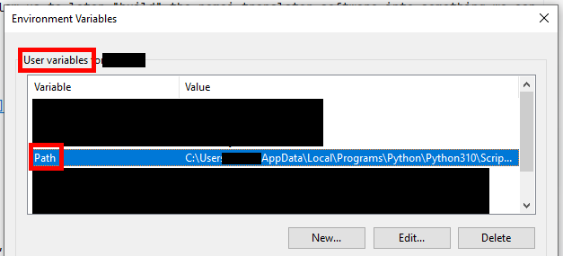

# Getting the Nomai Translator to _just work_

Sadly, you'll have to build the software yourself and run it via the command line, since I didn't want to put any
additional time into this.
But following these steps should be fool-proof, if not, please contact me.
You can skip any steps you have already performed, of course.

It looks like a lot, but it isn't, it's just detailed.

## 0. Prerequisites

I will be assuming that you have at least Java 11 installed on your system for this.
If not, you'll find plenty of installation instructions in the internet for this.

## 1. Install Maven

Any 3.x version of Maven will work fine for this.
Maven is a so-called build tool that will allow us to later "build" the nomai translator software into something we can
run on our computers.

### 1.1 Download Maven

Go to [https://maven.apache.org/download.cgi](https://maven.apache.org/download.cgi) and download the
`Binary zip archive` if you're on Windows or macOS and the `Binary tar.gz archive` if you're using linux.


### 1.2 Extract Maven

Now, depending on your Operating System (OS), either use right-click --> extract, the archive utilities or the command
line to extract the `.zip` or `.tar.gz` archive you downloaded.
Move the folder that is created to a location where your other programs rest, e.g. `C:\Program Files\apache-maven-...`.
This location is up to you to choose, but you'll have to remember it for the next step.

### 1.3 Adding Maven to the PATH

Adding a path to the **PATH** means that all files in a directory will be made accessible on the command line anywhere
you are on your system.
This is what we need, since the files we want to build reside in this project and not in the Maven folder.

Now, if you've placed your maven installation in the `Program Files` directory before, you should have a directory `bin`
in there, such as: `C:\Program Files\apache-maven-3.x.x\bin`.
Copy that full path into your clipboard, we'll need it later.

#### 1.3.1 Windows

On Windows, press the Win-key and enter `Edit the system environment variables` if you have your system on english, or
simply entering `path` in there will suffice too.
Press enter.

Then, click in `Environment Variables` at the bottom.

In the top list, double-click the `Path` variable.

Click the `New` button and paste the path to the maven bin directory in there.





#### 1.3.2 Linux / MacOS

Please look up how to add a path to your system PATH in the internet for these, as I have no idea on macOS and on Linux,
it depends on what distribution and shell you're using.
Come back when you've done this.

### 1.4 Validate install

Now, start the command line.
This is different depending on your OS, but usually, it's called `terminal` or `cmd` on Windows.
Press the Win/Start key and enter one of these terms and enter to open the command line.

Now, enter `mvn --version` and if you see something like this, it's worked.
Otherwise, please just look something up in the internet or check that you've done all steps above.

```shell
C:\Users>mvn --version
Apache Maven 3.9.3 (21122926829f1ead511c958d89bd2f672198ae9f)
Maven home: C:\Program Files\apache-maven-3.9.3
Java version: 19.0.2, vendor: Oracle Corporation, runtime: C:\Program Files\Java\jdk-19
Default locale: en_US, platform encoding: UTF-8
OS name: "windows 10", version: "10.0", arch: "amd64", family: "windows"
```

Keep the command line open for now.

## 2. Clone the repo and build the project

### 2.1 Clone the repository

If you have git installed, just enter `git clone https://github.com/YanWittmann/ow-written-nomai-lang` on your command
line that is still open, after using `cd Downloads` to switch into your downloads directory (or any other path you want,
it does not matter much):

```shell
C:\Users\<username>\Downloads>git clone https://github.com/YanWittmann/ow-written-nomai-lang

Cloning into 'ow-written-nomai-lang'...
remote: Enumerating objects: 603, done.
remote: Counting objects: 100% (82/82), done.
remote: Compressing objects: 100% (41/41), done.
remote: Total 603 (delta 12), reused 68 (delta 7), pack-reused 521
Receiving objects: 100% (603/603), 48.34 MiB | 22.84 MiB/s, done.
Resolving deltas: 100% (153/153), done.
```

Otherwise, download and extract (just as before) the zip version:
[https://github.com/YanWittmann/ow-written-nomai-lang/archive/refs/heads/main.zip](https://github.com/YanWittmann/ow-written-nomai-lang/archive/refs/heads/main.zip)

### 2.2 Build the project

Now copy the path to the directory, e.g. `C:\Users\<username>\Downloads\ow-written-nomai-lang` and get back to the
terminal.
There, enter `cd <your-path>` where you replace `<your-path>` with the path your copied to the repository to switch
directories.

In there, with maven installed properly beforehand, enter these commands one by one and wait for them to complete:

```shell
cd nomai-language-core
mvn clean install
```

Then, without switching directories:

```shell
cd ../nomai-language-cli
mvn clean package
```

### 2.3 Accessing the jar file

The jar file should have been successfully been built into the `target` directory.
You can now access it by using:

```shell
cd target
java -jar nomai-language-cli.jar
```

Which should display the help message:

```shell
C:\Users\<username>\Downloads\ow-written-nomai-lang\nomai-language-cli\target>java -jar nomai-language-cli.jar
Usage: java -jar nomai-language-cli.jar [options]
Options:
  -text, -t, --text, --t <text>     The text to render.
  -style, -s, --style, --s <style>  The style of the text. Either a file path or one of: wall 1, wall 2, wall 3, cliff, quantum, space, black, transparent
  -output, -o, --output, --o <path> The path to the output file. If not specified, a random file name will be generated.
  -help, -h, --help, --h            Show this help message.

```

## 3. Running the project

Still in the same directory on your command line, enter, for example, enter the following to generate an image:

```shell
C:\Users\<username>\Downloads\ow-written-nomai-lang\nomai-language-cli\target>java -jar nomai-language-cli.jar -t "Hello World" -s space
Loaded dictionary with [126052] entries from: /ow-lang/cmudict.dict
Loaded conversion table with [84] entries from: /ow-lang/cmudict-to-ow.txt
Transformed text into [1] branch snippets
Tokenizing text [Hello World]
Generating shapes for node tree with depth [6]
Distributed [10] letter shapes
Largest x is [712.0]
Picked scale [1.4000000000000001] for x [712.0]
Transformed letter shapes along curve [{0.0,0.0},{-288.40000000000003,-368.20000000000005},{147.0,-637.0000000000001},{168.00000000000003,-322.00000000000006}]
Generated [9] connecting lines
Combining [1] drawable branches, where the first one has [19] drawables
Styling nomai text with colors: java.awt.Color[r=239,g=236,b=251], java.awt.Color[r=162,g=158,b=187], java.awt.Color[r=135,g=131,b=159]
Overlaying nomai text with background

Wrote image to: C:\Users\<username>\Downloads\ow-written-nomai-lang\nomai-language-cli\target\generated-nomai-lang-1711094722994.png
          Text: Hello World
         Style: space
   Explanation: h uh l oh | w eh l d
```

In that same target directory, an image has been created from your text.
See the more detailed instructions on how the use the command line interface in the main [readme.md](readme.md) to learn
about all parameters or read the help message above.

Thanks for using this tool!
Please, if you want, feel free to let me know about the images you created, I really want to know how people use it!


