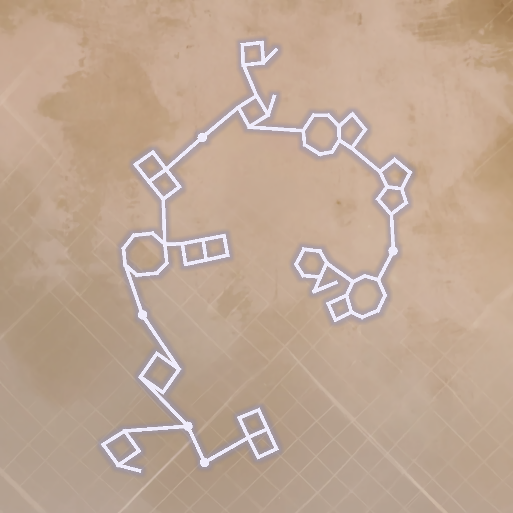
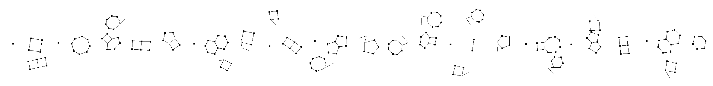
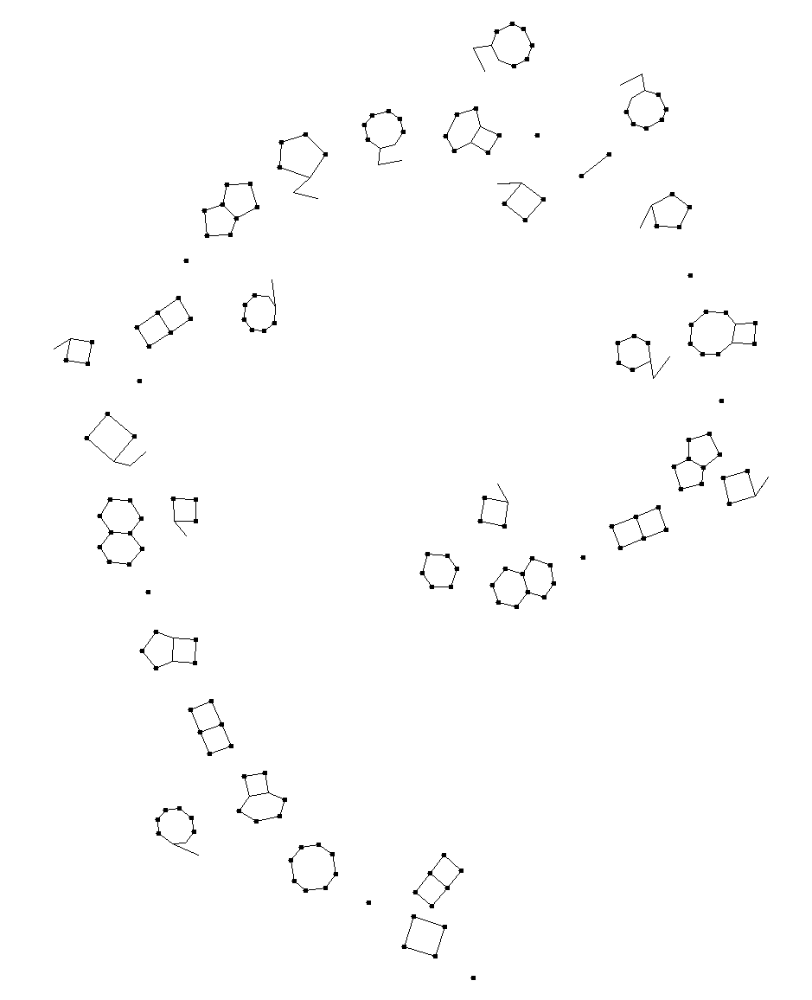
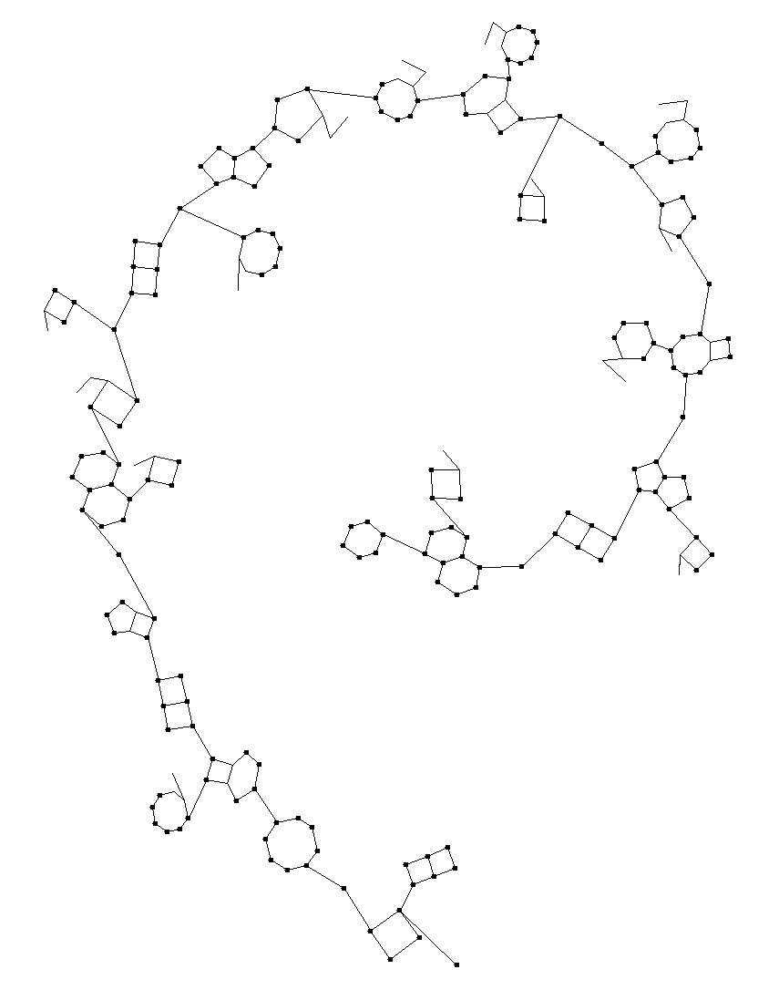
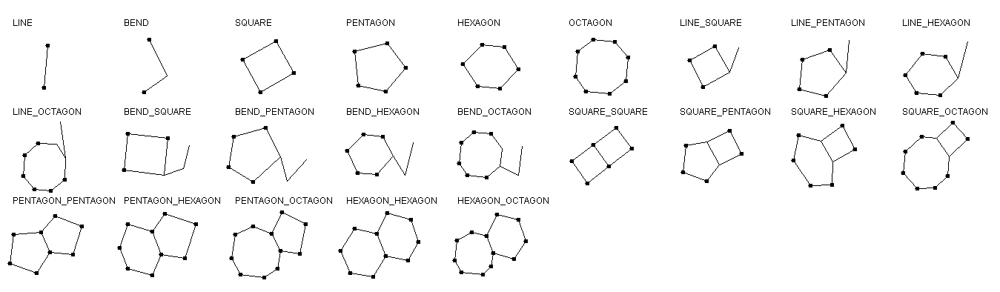
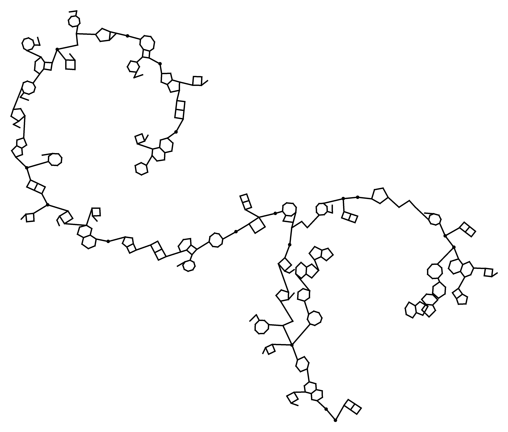
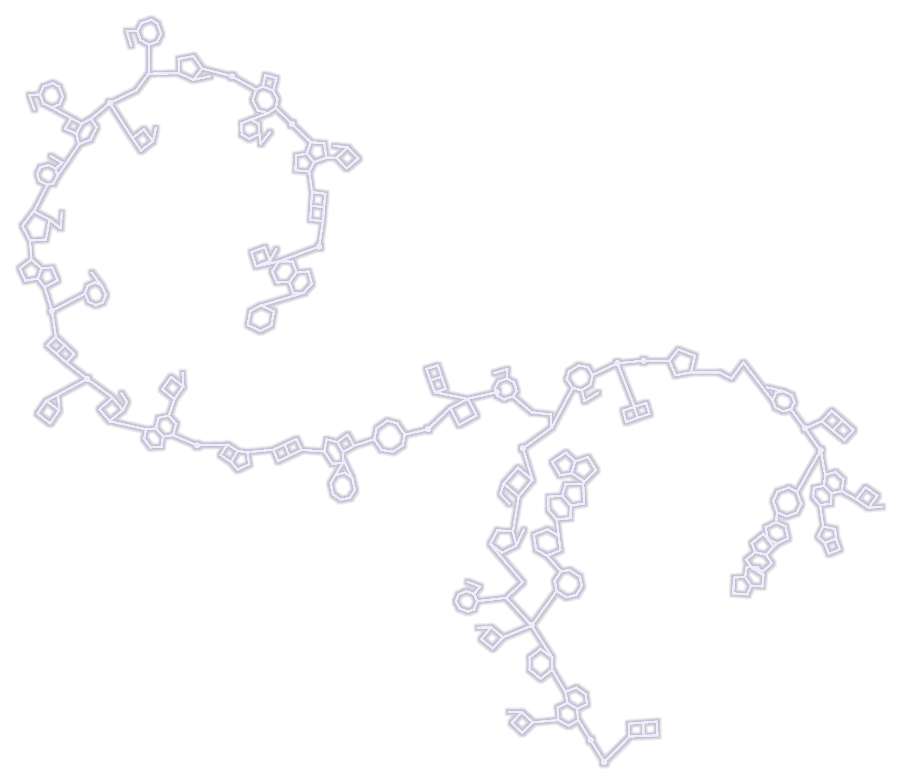

# Written Nomai Language Image Generator

> [!TIP]
> Are you just looking to get it to work without being a developer? Check out the [get-it-working.md](get-it-working.md)
> file. Otherwise, use the build instructions below to build the project.

This (Java) project can generate an image with a spiral of symbols _resembling_ the text of the Nomai language from the
game [Outer Wilds](https://www.mobiusdigitalgames.com/outer-wilds). Since the game doesn't truly have a translatable
language, this project uses the conversion method published by
[u/36CornDogs](https://www.reddit.com/r/outerwilds/comments/15fj6yu/took_a_shot_at_a_nomai_writing_system/) on Reddit.

* [Introduction](#introduction)
* [Build instructions](#build-instructions)
* [Usage (CLI)](#usage-cli)
* [Rules](#language-rules)
* [Conversion table](#conversion-table)
* [Process explained](#process-explained)
* [Licenses](#licenses)
* [How to use the core lib](#hardcore-core-library-usage)

## Introduction

The language is made up of symbols, connected by lines. These chains of symbols are usually arranged in a spiral. Below
are some sample images generated by this tool:

|  |                                          |
|:-------------------------------------------------:|:---------------------------------------------------------------------------:|
|     I have 3287 apples but I wish I had 3288      | This translator will work on multiple sentences. See, this is a new branch. |

|                                                    |  |
|:---------------------------------------------------------------------------------------------------:|:-----------------------------------:|
| I have 3287 apples but I wish I had 3288. My friend has an extra apple you can have. Oh, thank you! |        I am fine, thank you!        |

## Build instructions

> [!TIP]
> Are you just looking to get it to work without being a developer? Check out the [get-it-working.md](get-it-working.md)
> file. Otherwise, use the build instructions below to build the project.

Originally, I did not think there was much interest in checking out this project by anyone else; yet here we are. I've
cleaned up the codebase as much as I could; it's still not perfect, but it should be understandable. If you are the
average user of this project, just **build the core module and CLI application** using the instructions below.

The project is built using [Maven](https://maven.apache.org/download.cgi).

### > Core

The core module contains the logic to convert a text into a list of symbols and from there into an image. It can be
used in your own project or by the CLI application below.

If you want to learn more about the core module, see the [How to use the core lib](#hardcore) section.

```shell
cd nomai-language-core
mvn clean install
```

### > CLI

The CLI application is a simple wrapper around the core module. It can be used to generate images from the command line.
See the [Usage (CLI)](#usage-cli) section for more information.

```shell
cd nomai-language-cli
mvn clean package
cd target
java -jar nomai-language-cli.jar
```

### (Reddit Bot)

If you're especially interested, you can also build the Reddit Bot I used in
[this Reddit post](https://www.reddit.com/r/outerwilds/comments/15m8qhc/written_nomai_translator_bot/?sort=new)

For this to work, you will first have to create a Reddit application and fill in the credentials in the
[RedditBotMain.java](nomai-language-reddit-bot/src/main/java/de/yanwittmann/RedditBotMain.java) file, then you should be
able to test it on the configured post using the instructions listed in the post above.

```shell
cd nomai-language-reddit-bot
mvn clean package
```

## Usage (CLI)

The CLI application can be used to generate images from the command line. The following arguments are available:

| Argument        | Description                                                                                                               | Default Value                         |
|-----------------|---------------------------------------------------------------------------------------------------------------------------|---------------------------------------|
| `-text`, `-t`   | The text to render. This is the only required argument.                                                                   | required                              |
| `-style`, `-s`  | The style of the text. Either a file path or one of: `wall 1, wall 2, wall 3, cliff, quantum, space, black, transparent`. | `wall 1`                              |
| `-output`, `-o` | The path to the output file.                                                                                              | A random file name will be generated. |
| `-help`, `-h`   | Show the help message.                                                                                                    |                                       |

Example:

```shell
java -jar nomai-language-cli.jar -text I have 3287 apples -style wall 1
```

It will not only generate the image, but also a file `generated-files.json`, where a JSON Array of all generated files
with their corresponding text is stored.

## Language Rules

See the original post for a more detailed explanation:
[https://www.reddit.com/r/outerwilds/comments/15fj6yu/took_a_shot_at_a_nomai_writing_system/](https://www.reddit.com/r/outerwilds/comments/15fj6yu/took_a_shot_at_a_nomai_writing_system/)

- there are the following symbols: line, bend, square, pentagon, hexagon, octagon
- a "letter" is either a single symbol or two symbols combined
- the delimiter between letters is a single line
- the delimiter between words is a line connected to a dot connected to another line
- vowels branch off from the letter or word dot that came before it
- numbers branch off from the previous word dot
- this means, a word dot can have three lines coming out of it: consonant, vowel and number, and you must read them in
  the order "number", "vowel" and "consonant"

## Conversion table

If the letter you read is a consonant, start with the top row. If it is a vowel, start with the left column. Then,
use the other side to find the corresponding phoneme.

| vowels v / consonants > |    | Line | Bend | Square | Pentagon | Hexagon | Octagon |
|-------------------------|----|------|------|--------|----------|---------|---------|
|                         |    | p    | b    | m      | w        | v       | f       |
| Line                    |    |      |      | th     | l        | ch      | sh      |
| Bend                    | ih |      |      | z      | s        | j       | t       |
| Square                  | 0  | aah  | iy   | ay / n | d        | r       | y       |
| Pentagon                | 1  | ah   | oh   | 4      | 7 / k    | g       | ng      |
| Hexagon                 | 2  | eee  | oo   | 5      | 8        | 10 / h  | oy      |
| Octagon                 | 3  | eh   | uh   | 6      | 9        |         |         |

Please note that I added `oy` to the table, as the closest would have been a combination from `oh` and `iy`.

## Process explained

Let's take it step by step. Let's use

```
I have 3287 apples but I wish I had 3288. My friend has an extra apple you can have.
```

as an example.

### Split the text into phonemes

We use the [cmudict](nomai-language-core/src/main/resources/ow-lang/cmudict.dict) from the CMU Pronouncing Dictionary
to look up the phonemes for each word. If a word does not exist in there, we split the word up into sub-tokens and
combine them back together later.

```
AY1 | HH, AE1, V | AE1, P, AH0, L, Z | B, AH1, T | AY1 | W, IH1, SH | AY1 | HH, AE1, D
M, AY1 | F, R, EH1, N, D | HH, AE1, Z | HH, AH0, Z | AE1, N | AH0, N | EH1, K, S, T, R, AH0 | AE1, P, AH0, L | Y, UW1 | K, AE1, N | K, AH0, N | HH, AE1, V
```

### Convert the phonemes to letters

These phonemes are then converted to letters using the conversion table above. This is a simple 1:1 mapping I created
for all available phonemes. This mapping is in
[cmudict-to-ow.txt](nomai-language-core/src/main/resources/ow-lang/cmudict-to-ow.txt).

The result is the following:

```
ay | h, aah, v | aah, p, uh, l, z | b, uh, t | ay | w, ih, sh | ay | h, aah, d | m, ay
f, r, eh, n, d | h, aah, z | aah, n | eh, k, s, t, r, uh | aah, p, uh, l | y, oo | k, aah, n | h, aah, v
```

### Creating a branching node tree from the letters

From this, we have to know in what directions to branch from what letter, since they are not drawn linearly, but in
three different lanes. I therefore split them up in three categories: consonants (C), vowels (V) and numbers (N).
Expand the spoiler below to see the result.

<details>
<summary>Expand me!</summary>

```
ROOT [V W]
  V [ay => SQUARE SQUARE SQUARE_SQUARE]

  ROOT [C]
    C [h => HEXAGON HEXAGON HEXAGON_HEXAGON]
      V [aah => SQUARE LINE LINE_SQUARE]
      C [v => HEXAGON _ HEXAGON]

        ROOT [V C N]
          V [aah => SQUARE LINE LINE_SQUARE]
          N [3 => OCTAGON _ OCTAGON]
            N [2 => HEXAGON _ HEXAGON]
              N [8 => HEXAGON PENTAGON PENTAGON_HEXAGON]
                N [7 => PENTAGON PENTAGON PENTAGON_PENTAGON]
          C [p => LINE _ LINE]
            V [uh => OCTAGON BEND BEND_OCTAGON]
            C [l => PENTAGON LINE LINE_PENTAGON]
              C [z => SQUARE BEND BEND_SQUARE]

                ROOT [C]
                  C [b => BEND _ BEND]
                    V [uh => OCTAGON BEND BEND_OCTAGON]
                    C [t => OCTAGON BEND BEND_OCTAGON]

                      ROOT [V W]
                        V [ay => SQUARE SQUARE SQUARE_SQUARE]

                        ROOT [C]
                          C [w => PENTAGON _ PENTAGON]
                            C [ih => _ BEND BEND]
                              C [sh => OCTAGON LINE LINE_OCTAGON]

                                ROOT [V W]
                                  V [ay => SQUARE SQUARE SQUARE_SQUARE]

                                  ROOT [C]
                                    C [h => HEXAGON HEXAGON HEXAGON_HEXAGON]
                                      V [aah => SQUARE LINE LINE_SQUARE]
                                      C [d => PENTAGON SQUARE SQUARE_PENTAGON]

                                        ROOT [C N]
                                          N [3 => OCTAGON _ OCTAGON]
                                            N [2 => HEXAGON _ HEXAGON]
                                              N [8 => HEXAGON PENTAGON PENTAGON_HEXAGON]
                                                N [8 => HEXAGON PENTAGON PENTAGON_HEXAGON]
```

</details>

### Drawing the shapes

The first step of rendering the tree is to draw the letter shapes. You might be wondering why the shapes are in a
straight line and not in a curve. This is actually, because distributing the shapes and the transformations applied to
the shapes are a lot simpler when applying them in a regular grid.

This is done for each sentence individually, so we result in multiple such images. They will be combined later. This is
the result for the first sentence:



### Applying a Bézier curve

The next step picks a Bézier curve from a set of pre-defined curves depending on the length of the text. This curve is
then scaled and transformed in a few way to make the shapes all fit on the curve nicely.

Then, the curve is used to span a coordinate system, which is used to translate the shapes from the previous step onto
the curve.



### Connecting the letter symbols

Since each letter symbol still knows it's original node in the branch node tree, we can now connect the letter symbols
with lines to visualize the tree structure. This is done by connecting the closest two points of the letter symbols with
a check that they do not intersect with any other letter symbols or lines.

But not just any two points can be connected in this way, see the table below for an overview of the possible symbols
and their connection points.

<br>



### Combining the curves

Now we're pretty far already. The last step is to combine the curves from the previous steps into a single image. This
is done by combining the shapes such that the starting point of the next shape is at an offset of the first curve.

This offset is calculated based on several different factors, such as the length of both curves. Then, the curve is
angled a bit to make it look more natural.

In reality, before this step is performed, a few more checks are done. The most important one is: how many
intersection of shapes are there? If there are more than 0, up to 9 more iterations of all previous steps are performed
with a different seed and if the last iteration still has intersections, the best image with the best fit criteria is
chosen.



### Adding styling to the image

After all that work, it's time for decorating the image a bit. First, the image is overlayed a few times with copies of
itself that have been recolored, dilated and blurred.



### Adding a background

Then, a background from a set of pre-defined backgrounds is chosen. The available backgrounds are located in

- [src/main/resources/ow-lang/backgrounds](nomai-language-core/src/main/resources/ow-lang-renderer)
- [NomaiTextCompositor.java](nomai-language-core/src/main/java/de/yanwittmann/ow/lang/renderer/NomaiTextCompositor.java)


## Licenses

### cmudict

Source: [https://github.com/cmusphinx/cmudict](https://github.com/cmusphinx/cmudict)

This project includes the `cmudict.dict` file from the CMU Pronouncing Dictionary, which is covered by its own license.
The `cmudict.dict` file is located at
[src/main/resources/ow-lang/cmudict.dict](nomai-language-core/src/main/resources/ow-lang/cmudict.dict).

The license for the CMU Pronouncing Dictionary is located at
[src/main/resources/license/LICENSE-cmudict](nomai-language-core/src/main/resources/ow-lang/cmudict.dict).

## Hardcore (core library usage)

So all of this was not enough for you? You want to use the Nomai language in your own project? Well then let me show you
how to use the Nomai language core library.

The library functionality is mostly encapsulated in the `WrittenNomaiConverter` class. It expects several parameters:

```java
final WrittenNomaiConverter converter = new WrittenNomaiConverter();
converter.setTokenizer(new WrittenNomaiTextTokenizer(
    WrittenNomaiTextTokenizer.class,
    "/ow-lang/cmudict.dict",
    "/ow-lang/cmudict-to-ow.txt"
));
converter.setLineGenerator(new LetterToLineConverter());
converter.setTransformAlongCurveProvider(WrittenNomaiConverter::lengthDependantUpwardsSpiralBezierCurveProvider);
```

So, what is going on in there?

- The `WrittenNomaiTextTokenizer` expects either two resource paths to the conversion tables with a class from which to
  pull the resources from, or two File instances if you want to load them from files.
- The `LetterToLineConverter` has several attributes that allow you to control the gaps, margins, scales and more of
  the letters in the image. The default settings are fine most of the time. If you really want to customize this, dive
  a bit deeper even, and modify the source code of the core lib to truly customize everything.
- The `Function<List<LetterShape>, BezierCurveCoordinateSystem> transformAlongCurveProvider` is a function that will
  return a `BezierCurveCoordinateSystem` to use when generating the curved text. The
  `WrittenNomaiConverter::lengthDependantUpwardsSpiralBezierCurveProvider` is the default provider and will return
  different curves depending on the length of the generated text. Check out the
  [BezierEditor.java](nomai-language-core/src/test/java/de/yanwittmann/ow/lang/BezierEditor.java) to learn how to build
  your own curves or execute the class to run a small curve designer that allows building your own curves using
  drag-and-drop (right-click to add points!).

### Converting a single sentence into drawables

Then you can use the `convertTextToNodeTree` method on the `WrittenNomaiConverter` to transform a string into a node
tree that can be transformed into drawable objects using the `convertNodeTreeToDrawables` method:

```java
final WrittenNomaiBranchingLetterNode tree = converter.convertTextToNodeTree("Nomai text generator!");
// 10 = attempts to generate a 'nice' looking result
final WrittenNomaiConverter.DrawablesResult shapes = converter.convertNodeTreeToDrawables(random, 10, tree);
final List<Object> drawables = shapes.getDrawables();
```

Btw I'm sorry that the return value is `List<Object>`. At the time I just wanted to get the project done and was
constantly mixing and changing drawable types from different sources.

### Converting multiple sentences into drawables

Here we can't use the comfort of having the `convertTextToNodeTree` method doing all for us

```java
// true would split within sentences when length of 50 is reached
final List<String> snippets = converter.getTokenizer().convertTextToBranchSnippets(normalText, false);

final Map<String, WrittenNomaiBranchingLetterNode> snippetTrees = new LinkedHashMap<>();
final Map<String, WrittenNomaiConverter.DrawablesResult> snippetShapes = new LinkedHashMap<>();

for (String snippet : snippets) {
    final List<List<String>> tokens = converter.getTokenizer().tokenizeToStringTokens(snippet);
    final List<List<WrittenNomaiTextLetter>> words = converter.getTokenizer().convertStringTokensToLetters(tokens);
    final WrittenNomaiBranchingLetterNode tree = WrittenNomaiBranchingLetterNode.fromSentence(words);
    final WrittenNomaiConverter.DrawablesResult shapes = converter.convertNodeTreeToDrawables(random, 10, tree);

    snippetTrees.put(snippet, tree);
    snippetShapes.put(snippet, shapes);
}

final List<Object> drawables = converter.combineMultipleDrawableBranches(snippetShapes.values());
```

### Render your drawables in a UI

You can use the built-in renderer that uses awt graphics to display your image if you just want to view it.

```java
final LanguageRenderer renderer = new LanguageRenderer();
renderer.setSize(1000, 1000);
renderer.setVisible(true);
renderer.setLocationRelativeTo(null);
renderer.setCropImage(true); // this will scale your image to fit the window size
renderer.setShapes(drawables);
```

### Render your drawables into an image file

Rendering the language is not the issue, styling it is. You again have to initialize a `LanguageRenderer`, but this time
we will use the `renderShapes` method to get an image from it and use several steps to make the image look nice.

You can do whatever with the resulting image, write it into a file or post it on Reddit.

```java
final LanguageRenderer renderer = new LanguageRenderer();
renderer.setOffset(new Point2D.Double(0, 0));
renderer.setLineThickness(9);
renderer.setDotRadius(12);

renderer.setShapes(drawables);

final BufferedImage baseRenderedImage = renderer.renderShapes(8000, 8000, 2, new Point2D.Double(4000, 7800)); // 2 = scale
final BufferedImage croppedRenderedImage = renderer.cropImageToTarget(baseRenderedImage, 70); // 70 = padding

// all presets are stored in NomaiTextCompositor, e.g. NomaiTextCompositor.BACKGROUND_NOMAI_WALL_HANGING_CITY, but this could also be a custom image
final BufferedImage backgroundImage = ...;

final NomaiTextCompositor nomaiTextCompositor = new NomaiTextCompositor();

final BufferedImage blueStyledImage = nomaiTextCompositor.styleNomaiTextLightBlue(croppedRenderedImage);
final BufferedImage resizedStyledImage = LanguageRenderer.resizeImageMaintainAspectRatio(blueStyledImage, backgroundImage.getWidth() - backgroundImagePadding * 2, backgroundImage.getHeight() - backgroundImagePadding * 2);
final BufferedImage styledTextWithBackground = nomaiTextCompositor.overlayNomaiTextWithBackground(resizedStyledImage, backgroundImage);
```

That's pretty much it, now you know how to generate images using my little library! If you end up using it somewhere, I
would appreciate some credits, and that you're letting me know so that I can check it out!

### Cool stuff to play around with in this project

- [Live-edit the generated text and curve](nomai-language-core/src/test/java/de/yanwittmann/ow/lang/WrittenNomaiTextTokenizerTest.java)
  (main at bottom, also try setting the parameter to `true`!)
- [View all the shapes used to generate the spirals](nomai-language-core/src/test/java/de/yanwittmann/ow/lang/ShapeDefinitionVisualizer.java)
